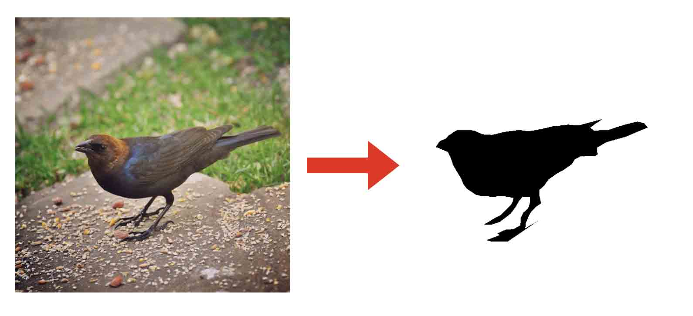

# polygon2mask

A function to transfer polygon to mask, which use 1 to signal the inner points.

  
  
Example p2m output.

## Interface
- image_size: [H, W]
- polygon: the coordinate of polygon, such as [x1,y1,x2,y2,...,xn,yn]
- return: mask numpy of image_size, 1 means points in polygon

## Details

- [Description of polygon2mask algorithm](https://zhuanlan.zhihu.com/p/87433705)
